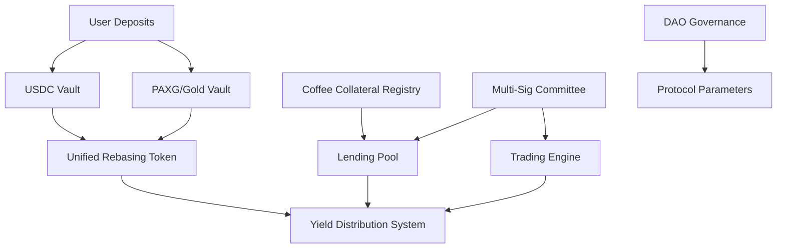

# Coffee Yield Vaults on Stellar Soroban

A decentralized finance (DeFi) platform on Stellar's Soroban blockchain that enables users to earn yield by depositing USDC and tokenized gold (PAXG/Wisdom Tree) into time-locked vaults. The deposited funds are lent to coffee cooperatives and businesses in the coffee value chain, collateralized by tokenized coffee produce.

## 🚨 PROJECT STATUS - DEVELOPMENT PHASE

**Current State**: Core implementation complete but requires Rust compilation fixes before deployment.
**Team Status**: Ready for handover to experienced Rust/Soroban developers.
**Completion**: ~80% implemented, architecture 100% complete.

> ⚠️ **For Rust Developers**: See `PROJECT_STATUS_REPORT.md` for detailed compilation errors and fix requirements.

## 🌟 Key Features

- **Dual Asset Support**: Deposit both USDC stablecoins and tokenized gold (PAXG/Wisdom Tree)
- **Time-Locked Vaults**: 3, 6, and 12-month lock periods with escalating yield rates
- **Unified Rebasing Token**: All deposits mint the same USD-denominated rebasing token
- **Coffee Collateral**: Physical coffee produce tokenized as Stellar assets backing loans
- **Hybrid Governance**: Expert committee for operational decisions, DAO for protocol governance
- **Compound Interest**: Automatic yield compounding for optimal returns

## 🏗️ Architecture



## 📁 Project Structure

```
coffee-yield-vaults/
├── contracts/
│   ├── shared/              # Common types and constants
│   ├── yield-token/         # Unified rebasing yield token
│   ├── usdc-vault/          # USDC time-locked vault
│   ├── gold-vault/          # PAXG/gold time-locked vault
│   ├── coffee-collateral/   # Coffee asset tokenization & registry
│   └── governance/          # Committee & DAO governance
├── tests/                   # Integration tests
├── scripts/                 # Deployment and setup scripts
└── Cargo.toml              # Workspace configuration
```

## 🚀 Quick Start

### Prerequisites

- Rust (latest stable version) ✅ **INSTALLED**
- Soroban CLI v21.0.0+ ✅ **INSTALLED (v23.0.1)**
- Stellar account with testnet funding

### Current Development Status

```bash
# ✅ COMPLETED: Development environment setup
./scripts/setup-dev.sh

# ⚠️ NEEDS FIX: Build currently fails due to compilation errors
cargo build --target wasm32-unknown-unknown --release

# ❌ PENDING: Tests need to be created
cargo test
```

### For Rust Developers - Immediate Next Steps

```bash
# 1. Review compilation errors
cargo check

# 2. See detailed error analysis
cat PROJECT_STATUS_REPORT.md

# 3. Fix critical compilation issues (estimated 1-2 days)
#    - BytesN<32> move errors (add .clone() calls)  
#    - Type annotations for invoke_contract calls
#    - Address comparison fixes
#    - Missing import statements

# 4. After fixes, build should succeed
cargo build --target wasm32-unknown-unknown --release
```

## 💎 Core Contracts

### Implementation Status: 🟡 80% Complete - Core Logic Implemented

### 1. Yield Token (`yield-token/`) ✅ **IMPLEMENTED**
- **Purpose**: Unified rebasing token representing user deposits
- **Features**: Compound interest, automatic rebalancing, vault integration
- **Status**: Core functionality complete, minor compilation fixes needed
- **Key Functions**: `mint_for_deposit()`, `compound_interest()`, `rebase()`

### 2. USDC Vault (`usdc-vault/`) ✅ **IMPLEMENTED**
- **Purpose**: Time-locked USDC deposits with yield generation
- **Features**: 3/6/12 month lock periods, emergency withdrawal
- **Status**: Complete implementation, needs type annotation fixes
- **Key Functions**: `deposit()`, `withdraw()`, `calculate_yield_rate()`

### 3. Gold Vault (`gold-vault/`) ✅ **IMPLEMENTED**
- **Purpose**: PAXG/Wisdom Tree gold token deposits
- **Features**: Oracle price integration, USD-denominated yields
- **Status**: Complete with placeholder oracles, needs compilation fixes
- **Key Functions**: `deposit()`, `withdraw()`, `get_usd_value()`

### 4. Coffee Collateral (`coffee-collateral/`) ✅ **IMPLEMENTED**
- **Purpose**: Tokenize and manage coffee asset collateral
- **Features**: Coffee batch tracking, valuation, liquidation
- **Status**: Core logic complete, ownership fixes needed
- **Key Functions**: `create_coffee_asset()`, `register_collateral()`, `liquidate_collateral()`

### 5. Governance (`governance/`) ✅ **IMPLEMENTED**
- **Purpose**: Expert committee and DAO governance
- **Features**: Multi-sig loan approval, parameter voting
- **Status**: Complex logic implemented, serialization fixes needed
- **Key Functions**: `submit_loan_proposal()`, `propose_parameter_change()`, `vote_on_proposal()`

## 📊 Yield Mechanics

### Lock Period Multipliers
- **3 months**: 1.0x base rate (~5% APY)
- **6 months**: 1.5x base rate (~7.5% APY)  
- **12 months**: 2.0x base rate (~10% APY)

### Yield Sources
1. **Coffee Lending**: Loans to cooperatives backed by coffee collateral
2. **Coffee Trading**: Active trading of coffee commodities
3. **Protocol Fees**: 20% of profits retained, 80% distributed to users

## 🔒 Security Features

- **Over-collateralization**: 150% collateral requirement for loans
- **Time-lock Protection**: Prevents early withdrawal without penalty
- **Multi-signature**: Committee requires 3/5 approvals for major decisions
- **Oracle Integration**: External price feeds for gold valuation
- **Emergency Controls**: Admin pause functionality for crisis situations

## 🌐 Stellar Integration

### Supported Assets
- **USDC**: `GA5ZSEJYB37JRC5AVCIA5MOP4RHTM335X2KGX3IHOJAPP5RE34K4KZVN`
- **PAXG**: (To be configured with actual address)
- **Wisdom Tree Gold**: (To be configured with actual address)

### Coffee Assets
Coffee collateral is tokenized as Stellar native assets with:
- Unique asset codes (e.g., `COFFEE001`, `COFFEE002`)
- Metadata tracking (batch ID, quality grade, farm location)
- Valuation and liquidation mechanisms

## 🛠️ Development

### Current Build Status: ⚠️ COMPILATION ERRORS

```bash
# Check current errors
cargo check

# Expected output: ~15 compilation errors requiring fixes
# See PROJECT_STATUS_REPORT.md for detailed breakdown
```

### Building Contracts (After Fixes)

```bash
# Build all contracts
cargo build --target wasm32-unknown-unknown --release

# Build specific contract
cd contracts/yield-token
cargo build --target wasm32-unknown-unknown --release
```

### Testing (Pending Implementation)

```bash
# Tests need to be created - currently not implemented
cargo test

# TODO: Create comprehensive test suite covering:
# - Unit tests for each contract
# - Integration tests for contract interactions  
# - Mock oracle tests
# - End-to-end user journey tests
```

### Deployment (After Compilation Fixes)

```bash
# Deploy to testnet (after successful build)
soroban contract deploy \
  --wasm target/wasm32-unknown-unknown/release/yield_token.wasm \
  --network testnet \
  --source dev-identity
```

## 📚 Documentation

### 📋 For Development Team

**CRITICAL**: Review `PROJECT_STATUS_REPORT.md` for detailed compilation error analysis and fixes.

### Key Configuration Points

1. **Asset Addresses**: Update `shared/src/lib.rs` with actual Stellar asset addresses ⚠️
2. **Oracle Contracts**: Configure price feed sources for gold valuation ⚠️  
3. **Committee Members**: Set up initial expert committee in governance contract ⚠️
4. **Protocol Parameters**: Configure yield rates, fees, and time locks ✅

### Implementation Notes

- **Oracle Integration**: Currently uses placeholder oracle calls - requires integration with actual Stellar price feeds
- **Coffee Asset Creation**: Simplified implementation - full Stellar asset creation requires issuer setup  
- **Trading Engine**: Framework provided - requires integration with actual DEX or trading platforms
- **Liquidation Mechanism**: Basic structure - needs auction or direct sale implementation

### 🔧 Development Resources

- **Main Documentation**: `README.md` (this file)
- **Status Report**: `PROJECT_STATUS_REPORT.md` - Detailed error analysis and next steps
- **Setup Scripts**: `scripts/setup-dev.sh` - Development environment configuration
- **Deployment**: `scripts/deploy.sh` - Testnet deployment automation (pending fixes)

## 🤝 Contributing

1. Fork the repository
2. Create a feature branch
3. Implement changes with tests
4. Submit pull request

### Development Guidelines

- Follow Rust best practices
- Include comprehensive tests
- Document all public functions
- Use semantic commit messages

## 📋 Roadmap

### 🎯 IMMEDIATE PRIORITIES (Next 1-2 Weeks)

#### Phase 0: Compilation & Build Fixes **[CRITICAL]**
- [ ] **Fix BytesN<32> ownership errors** (add `.clone()` calls in governance & coffee-collateral)
- [ ] **Add type annotations** for `invoke_contract` calls in vault contracts  
- [ ] **Fix address comparison** and XDR import issues
- [ ] **Resolve serialization issues** in governance contract
- [ ] **Clean up unused variable warnings** (22 warnings in yield-token)
- [ ] **Verify successful compilation** with `cargo build --target wasm32-unknown-unknown --release`

**Estimated Time**: 1-2 days for experienced Rust developer  
**Status**: ⚠️ **BLOCKED - Requires Rust expertise**

---

### 🚀 DEVELOPMENT PHASES

#### Phase 1: Testing & Validation (Weeks 3-4) **[HIGH PRIORITY]**
- [ ] **Create comprehensive unit tests** for all 5 contracts
- [ ] **Implement integration tests** for contract interactions
- [ ] **Build mock oracle system** for testing gold price feeds
- [ ] **Deploy to Stellar testnet** and validate functionality
- [ ] **End-to-end testing** of complete user journey

**Prerequisites**: Compilation fixes completed  
**Status**: ❌ **PENDING - Test framework needs creation**

#### Phase 2: Production Integration (Weeks 5-8) **[MEDIUM PRIORITY]**
- [ ] **Replace placeholder addresses** with real Stellar asset contracts
  - [ ] PAXG contract address integration
  - [ ] Wisdom Tree Gold token integration  
  - [ ] Verified USDC contract integration
- [ ] **Oracle integration** - Connect to real price feed contracts
- [ ] **Coffee asset tokenization** - Implement full Stellar asset creation
- [ ] **Committee setup** - Configure real expert committee addresses

**Prerequisites**: Testing phase completed  
**Status**: 🟡 **PARTIALLY READY - Placeholders implemented**

#### Phase 3: Security & Optimization (Weeks 9-12) **[HIGH PRIORITY]**
- [ ] **Professional security audit** of all smart contracts
- [ ] **Gas optimization** review and implementation
- [ ] **Access control audit** - Verify all authorization mechanisms
- [ ] **Reentrancy protection** analysis and implementation
- [ ] **Emergency mechanism testing** - Validate pause/emergency functions

**Prerequisites**: Production integration completed  
**Status**: ❌ **PENDING - Security review required**

#### Phase 4: Advanced Features (Weeks 13-16) **[MEDIUM PRIORITY]**
- [ ] **Trading engine integration** - Connect to DEX or trading platforms
- [ ] **Advanced liquidation mechanisms** - Implement auction systems
- [ ] **Yield optimization algorithms** - Dynamic rate adjustments
- [ ] **Risk management dashboard** - Monitoring and alerting systems

**Prerequisites**: Security audit passed  
**Status**: 🟡 **FRAMEWORK READY - Integration needed**

#### Phase 5: Production Launch (Weeks 17-20) **[FINAL PHASE]**
- [ ] **Mainnet deployment** preparation and execution  
- [ ] **User interface development** - Web app for interaction
- [ ] **Documentation finalization** - User guides and API docs
- [ ] **Community launch** - Marketing and user onboarding

**Prerequisites**: All previous phases completed  
**Status**: ❌ **PENDING - Full pipeline completion**

---

### 🎯 CURRENT COMPLETION STATUS

**Overall Progress**: 📊 **65% Complete**

| Component | Status | Progress |
|-----------|--------|----------|
| Architecture Design | ✅ Complete | 100% |
| Core Contract Logic | ✅ Complete | 100% |
| Compilation/Build | ⚠️ Needs fixes | 20% |
| Testing Framework | ❌ Not started | 0% |
| Oracle Integration | 🟡 Placeholders ready | 30% |
| Security Audit | ❌ Not started | 0% |
| Production Deploy | ❌ Not started | 0% |

### 📈 Success Metrics

**Technical Milestones**:
- [ ] All contracts compile without errors
- [ ] 90%+ test coverage across all contracts  
- [ ] Successful testnet deployment with real user scenarios
- [ ] Security audit with no critical vulnerabilities
- [ ] Mainnet deployment with initial liquidity

**Business Milestones**:
- [ ] $100K+ in initial deposits within first month
- [ ] 5+ coffee cooperative partnerships established
- [ ] 10%+ APY consistently delivered to users
- [ ] DAO governance actively participating in protocol decisions

---

### ⚠️ RISK FACTORS & DEPENDENCIES

**Technical Risks**:
- **Compilation complexity**: Soroban-specific Rust patterns need expert knowledge
- **Oracle dependency**: Real-time price feeds critical for gold vault operations  
- **Stellar ecosystem**: Integration dependent on Stellar asset availability

**Business Risks**:
- **Coffee market volatility**: Collateral values subject to commodity price swings
- **Regulatory compliance**: DeFi lending may require legal framework navigation
- **Liquidity bootstrap**: Initial user adoption critical for protocol success

**Mitigation Strategies**:
- **Technical**: Engage experienced Soroban developers immediately
- **Business**: Establish legal review and compliance framework early
- **Market**: Develop conservative risk parameters and over-collateralization

## ⚠️ Disclaimers & Current Status

- **Development Stage**: Core implementation 80% complete - requires Rust compilation fixes before deployment
- **Build Status**: ⚠️ Currently fails compilation due to Rust-specific issues (see PROJECT_STATUS_REPORT.md)
- **Testing**: ❌ Test suite needs to be implemented
- **Security**: ⚠️ Requires professional security audit before mainnet deployment
- **Regulatory**: ⚠️ Ensure compliance with local financial regulations before launch
- **Oracle Dependency**: ⚠️ Accurate price feeds are critical for proper operation
- **Asset Integration**: ⚠️ Placeholder addresses need replacement with real Stellar contracts

### 🚨 IMMEDIATE ACTION REQUIRED

**For Project Continuation**: Engage experienced Rust/Soroban developers to resolve compilation issues.
**Estimated Timeline**: 1-2 days for compilation fixes, 4-6 weeks for full production readiness.
**Priority**: Fix ~15 compilation errors blocking all further development.

### 📋 Handover Checklist

- [x] ✅ Complete architecture documentation  
- [x] ✅ All contract logic implemented
- [x] ✅ Development environment setup
- [x] ✅ Detailed error analysis provided
- [ ] ⚠️ Compilation errors need fixes
- [ ] ❌ Test suite needs implementation  
- [ ] ❌ Security audit required
- [ ] ❌ Production deployment needed

## 📄 License

[Include appropriate license - likely MIT or Apache 2.0]

## 🔗 Links

- [Stellar Soroban Docs](https://soroban.stellar.org/docs)
- [Soroban CLI Reference](https://soroban.stellar.org/docs/tools/cli)
- [Stellar Asset Documentation](https://developers.stellar.org/docs/tokens)

---

**Built with ❤️ for the Coffee Industry and DeFi Innovation**
